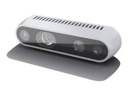
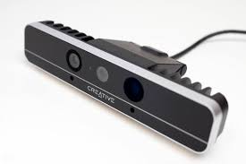
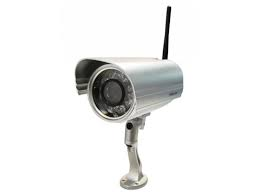
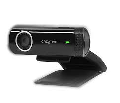

# Detect and calculate number of persons in room from several IP camera in real time using Tensorflow
A multithreaded program that calculate and detect number of persons in a room from an arbitrary amount of cameras with Tensorflow object detection.

<p align="center" >
  
  
  
  

</p>
<p align="center" >





</p>

# Demo
The demo below visualize how the program looks from two cameras and once depth camera. The fourth camera demonstrates what happens if a camera can't be captured by openCV. NOTE: lighting and the usage of identical cameras are crucial for performance!


The demo below visualize the usage of a vast amount of cameras. NOTE: close program by pressing "Q" button.


# Install & Run
This part describe the installation and running process.

## Install Program locally
Here we describe how to install the implementation on your local computer.

1. Install python

2. Install required packages
```
pip3 install -r requirements.txt
```
3. Done!

## Run Program locally
1. Change variables in "main.py".
2. Run main.py:
```
python3 main.py
```

# What exactly does this program do?
Here we describe what this implementation actually does!

## Multithreading and OpenCV
This implementation uses multithreading for async tasks such as receiving and handling Camera streams.
OpenCV is used to collect and visualize the streams.

## Auto Screen Splitting
This implementation also contains a auto screen splitter. Letting you add an arbitary amount of cameras in the
source_list. The camera streams will be evenly shared among all screen connected to the computer.

## Tensorflow Object Detection
A simple tensorflow object detection is used. It is a faster-rcnn trained on the COCO-dataset.
All models needed to run the implementation is in this repo, all used models is provided by Google developer team.

## Image Difference Calculations
To decide if a person has already been detected we use an image template probability match method to detect image differences.
This method is mainly used to make sure that a person is not calculated several times when seen from several cameras at once.

## The System Structure

<p align="center" >
  
</p>

# Contributions
The code for object detection assume from:
 https://github.com/jamesloyys/Real-Time-Object-Detection.git
